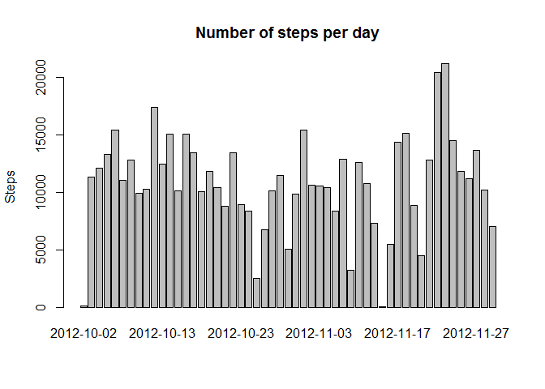

# Reproducible Research: Peer Assessment 1


## Loading and preprocessing the data
Downloading the ZIP file

```r
library(ggplot2)

download.file("https://d396qusza40orc.cloudfront.net/repdata%2Fdata%2Factivity.zip","Activity.zip")
unzip("Activity.zip")
activity<-read.csv("activity.csv")
activity2<-activity
activity2$date<-as.Date(activity$date, "%Y-%m-%d")
stepsbyday<-aggregate(steps~date,activity2,sum)
barplot(stepsbyday$steps, main="Number of steps per day",ylab="Steps",names.arg=stepsbyday$date)
```

 

## What is mean total number of steps taken per day?
The mean total number of steps taken per day is 1.0766189\times 10^{4}

The median is 10765

## What is the average daily activity pattern?

```r
meansteps.interval<-aggregate(steps~interval,activity2,mean)

plot(meansteps.interval$interval,meansteps.interval$steps,type="l", main="Avg Daily Activity Pattern", xlab="Interval",ylab="Avg Steps")
```

 
The 835 interval has the max number of steps

## Imputing missing values
The number of total rows missing values is 1

The strategy to impute missing values are to replace NA with mean for that interval. "ActivityIm" is the new dataset with imputed values


```r
activityImp<-activity2
activityImp$steps<-ifelse(is.na(activity2$steps),meansteps.interval$steps[match(meansteps.interval$interval,activity2$interval)],activity2$steps)

stepsbyday2<-aggregate(steps~date,activityImp,sum)

barplot(stepsbyday2$steps,main="Total number of steps taken per day w Imputed Data", ylab="Steps",names.arg=stepsbyday2$date)
```

 

The new mean, with imputed data is 1.0766189\times 10^{4}

The new median, with imputed data is 1.0766189\times 10^{4}

The difference between the imputed and original mean is 0
and difference in median is 1.1886792


## Are there differences in activity patterns between weekdays and weekends?


```r
wkday <- c("Monday","Tuesday","Wednesday","Thursday","Friday")
activityImp$wkday<-factor(ifelse(weekdays(activityImp$date) %in% wkday,"Weekday","Weekend"))

stepsbywkday<-aggregate(steps~interval+wkday,activityImp,mean)
qplot(interval,steps, data=stepsbywkday, geom=c("line"), facets=wkday~.)
```

 

